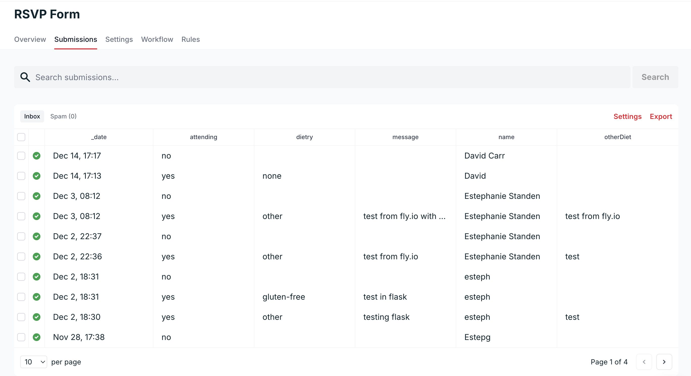

# Wedding Website

#### Video Demo: <URL>

#### Live Site: https://estephanddavid.com/

#### Description:
At the time of choosing a project to submit as part of CS50, I had recently booked my wedding venue for September 2026 and knew I would need a wedding website. After exploring existing website templates, I found them either too restrictive in terms of customisation or the ones I really liked were too expensive. This led me to build my own website as my final project.

By building the site from scratch, I was able to design and implement a solution tailored to my requirements rather than adapting my needs to an existing platform, making the project both practical and personally meaningful.

The website centralises all essential wedding information in a single application, including event details, venue and travel information, FAQs, Dress code and the ability to RSVP online.

The project combines frontend development for layout and styling with backend logic for routing, templating, authentication, and form handling via an external API. This is a full-stack web application built using Flask, Python, HTML, CSS, and JavaScript, and deployed on Fly.io. 

## Project Status

At the time of submission, the wedding is scheduled for next year. 
Some details will be updated after the CS50 submission deadline as wedding plans are finalised. The core structure and functionality will remain unchanged.

## Features

- Responsive website for mobile and desktop devices.

- Wedding event details, including date, time, and location.

- Venue, travel, and accommodation information.

- FAQs, registry, and dress code details.

- RSVP form integrated with Formspree for submission handling and dashboard viewing.

- Client-side enhancements using JavaScript, including dynamic form behaviour, countdown timer, smooth scrolling, and session-aware navigation.

- Password-protected guest access with validation using Python.

- Backend routing and templating using Flask.

- Automated deployment to Fly.io using Docker and GitHub Actions, enabling instant updates to the live site.

## Technologies used

- **Python**: Used to build the backend logic with Flask.

- **Flask**: Handles routing, template rendering, and application structure.

- **HTML**: Used to structure the website content.

- **CSS**: Used for styling and responsive layout.

- **Bootstrap**: Used for page tabs and accordions.

- **Favicon**: Added to improve site identification in browser tabs and bookmarks.

- **JavaScript**: Used for client-side interactivity and form validation.

- **Formspree**: Used for RSVP form integration.

- **Fly.io**: Used to host the application.

- **Github Actions**: Automates deployment, integrated with Fly.io.

- **Docker**: Used to containerise the application for deployment on Fly.io.

- **AWS Route 53**: Used for custom domain registration and DNS routing to Fly.io.

## File Structure
An overview of the project's file structure, showing how the code, templates, static assets, and configuration files are organised.

```
.
├── .github/
│   └── workflows/
│       └── fly-deploy.yml      # GitHub Actions workflow for automated deployment
├── static/
│   ├── css/
│   │   └── style.css          # Styling and responsive layout
│   ├── favicon/
│   │   └── favicon assets      # Folder with Favicon generated files
│   ├── js/
│   │   ├── countdown.js        # Countdown to wedding day
│   │   ├── login.js            # Prevents page reload on incorrect password
│   │   ├── rsvp.js             # RSVP form interactivity
│   │   ├── scrolldown.js       # Scroll down function
|   |   ├── scrollup.js         # Scroll up function
│   │   └── visited.js          # Prevents home page animations on repeat visits
│   └── images/
│       ├── formspree.jpg       # Screenshot used in README
│       └── full-dress-code.jpg # Dress code image
├── templates/
│   ├── base.html               # Base template
│   ├── index.html              # Password-protected login page
│   ├── home.html               # Homepage
│   ├── rsvp.html               # RSVP page
│   ├── schedule.html           # Wedding weekend schedule
│   ├── travel.html             # Venue and travel information page
│   ├── airbnb.html             # Accommodation recommendations
│   ├── deal.html               # Activities recommendations
│   ├── registry.html           # Registry page
│   └── faq.html                # FAQs page
├── .dockerignore               # Files to ignore in Docker builds
├── .gitignore                  # Files to ignore in GitHub
├── app.py                      # Main Flask application and route definitions
├── Dockerfile                  # Docker configuration for Fly.io deployment
├── fly.toml                    # Fly.io application configuration
├── README.md                   # Project documentation
├── requirements.txt            # Python dependencies
└── robots.txt                  # Control search engine indexing

```

## Design

#### Frontend 

The frontend is built using HTML, CSS, and JavaScript. HTML provides the structural layout of the website, while CSS is responsible for styling, animations, and responsive layouts across mobile and desktop devices. JavaScript is used to enhance interactivity and dynamic behaviour, such as adapting form fields based on user input (for example, conditionally displaying additional fields for dietary requirements), handling browser sessions, implementing a countdown to the wedding date, and enabling smooth scrolling between sections.

In addition to the above, a favicon was added to help the user identify the site easily in browser tabs and bookmarks.

This combination ensures a smooth, user-friendly experience while keeping the frontend logic focused on usability and presentation.

#### Backend

The backend is built using Flask, which handles routing, templating, and overall application structure. Pages use Jinja templates to render content dynamically and password-protected access ensures that only invited guests can view the content of the website.

Password validation is handled in the backend using environment variables, with values defined locally for development and securely configured as `secrets` in Fly.io for production. This avoids hardcoding sensitive information in the codebase and follows basic security best practices. Backend logic verifies user input before granting access, while frontend JavaScript manages the user interaction.

This separation of concerns keeps the backend focused on application logic and security, while the frontend handles presentation and interactivity.

#### Authentication flow

The application uses a simple password-based authentication mechanism. Login is handled using an AJAX request (`login.js`) rather than a traditional server-side redirect. This design was chosen to:

- Prevent full page reloads on failed login attempts
- Allow client-side error handling and animations
- Ensure correct password logins are handled without errors

The Flask `/` route always returns JSON responses for login attempts. On successful authentication, the frontend JavaScript performs the redirect to `/home`.

***Note:*** 
During deployment to Fly.io, using a server-side redirect caused a 500 Internal Server Error, even when the correct password was submitted. Switching to a JSON response handled entirely by JavaScript resolved this, ensuring reliable redirects and proper error handling. Further details are documented in the **Bug Fixes** section.

#### RSVP form Handling

The RSVP form is implemented using [Formspree](https://formspree.io/), a third-party service that handles form submissions securely, including data validation. Formspree also provides email notifications, a dashboard to view all submissions, and analytics.

Because Formspree effectively manages all aspects of form collection and viewing, I chose not to use a database for this project. While a database was initially considered, it was unnecessary: the data does not require complex querying, relationships, or long-term persistence within the application. RSVP responses only need to be viewed, not modified or processed programmatically.

This approach keeps the website lightweight while taking advantage of Formspree’s built-in features, including email notifications for each submission, which makes it easy to track RSVPs in real time.



*Screenshot shows example responses in the Formspree dashboard. All data is test information.*


#### Platform hosting

The project was initially hosted on [AWS Amplify](https://aws.amazon.com/amplify/), as the website was originally planned as a static application. Amplify provides a simple and cost-effective way to deploy static sites quickly and was well suited for the early version of the project.

As the scope evolved, the website was refactored into a Flask application to support dynamic routing, server-side templating, and more secure password handling. During this transition, it became clear that the project would benefit from a hosting platform capable of running a backend application with minimal setup and overhead.

After evaluating several options, [Fly.io](https://fly.io/) was selected due to its native Docker support, lightweight configuration, and ability to deploy applications close to users geographically. This was particularly important given that guests will be accessing the site not only from the UK, but also from Europe, North America, and Japan. Fly.io also made it straightforward to integrate a custom domain, allowing the domain purchased through [AWS Route 53](https://aws.amazon.com/route53/) to be linked directly to the deployed application.

#### CI/CD

Deployment is automated using Fly.io’s integration with [GitHub Actions](https://github.com/features/actions). When the application was initially deployed to Fly.io, a GitHub Actions workflow was generated to handle future deployments. This workflow triggers on pushes to the `main` branch, automatically building a Docker image of the application and deploying it to Fly.io.

Any changes pushed to the repository are automatically deployed to the live site, reducing manual steps and ensuring consistency between local development and production. While additional automation or features could be added, this workflow provides sufficient functionality for the scope of the website.

## Manual testing

Manual testing was carried out to verify core user flows and ensure the application behaves as expected in a production environment. This included testing authentication, navigation between pages, and access control for protected routes, as well as validating user-facing interactions such as error messages and animations.

Tests and results are documented in [`docs/manual-testing.md`](docs/manual-testing.md).

## How to run locally

To run the wedding website locally, follow these steps:

**Prerequisites:**
- Python 3.10+ installed

- Pip installed (Python package manager)

- (Optional) Docker if you want to run via container

**Steps:**
1. Clone the repository
    ```
    git clone https://github.com/Esteph27/wedding-website.git
    cd wedding-website
    ```

2. Set up a virtual environment
    ```
    python -m venv venv
    source venv/bin/activate   # On Windows: venv\Scripts\activate
    ```

3. Install dependencies
    ```
    pip install -r requirements.txt
    ```

4. Set environment variables

The password for accessing protected pages is not included in the repository. You will need to create your own `.env` file with a `PASSWORD` (and optionally `FLASK_SECRET_KEY`) to run the site locally.

    PASSWORD=<choose-a-password>
    FLASK_SECRET_KEY=<your-secret-key>  # Optional, for session security

5. Run flask application
    ```
    export FLASK_APP=app.py
    export FLASK_ENV=development
    flask run
    ```

Open your browser at http://127.0.0.1:5000 to view the website locally.

6. Run using Docker (optional)
    ```
    docker build -t wedding-website .
    docker run -p 5000:5000 wedding-website
    ```

Then open your browser at http://127.0.0.1:5000.

**Notes:**

- RSVP submissions locally will only work if you have your own Formspree account and endpoint. The current endpoint in the project is private, so you will not receive notifications or see submissions unless you replace it with your own.

## Deployment

The wedding website is deployed on Fly.io, which allows the Flask application to run as a containerised service accessible worldwide. Deployment is automated via GitHub Actions:

**1. CI/CD Workflow**

- Any push to the `main` branch triggers the Fly.io GitHub Actions workflow.

- The workflow builds a Docker image of the application and deploys it to Fly.io automatically.

- This ensures the live site is always up-to-date with the latest changes.

**2. Custom Domain**

- The website is linked to a custom domain purchased via AWS Route 53. Fly.io automatically routes traffic to the live application using this domain. 

**3. Environment Variables**

- Secrets such as `PASSWORD` and `FLASK_SECRET_KEY` are configured in Fly.io’s environment settings. This keeps sensitive data secure and separate from the codebase. 


## Linters

To maintain code quality and consistency, the following tools were used:

### Backend (Python)
- **Flake8**  
    Used to enforce PEP8 style guidelines and identify common issues such as unused imports and formatting inconsistencies in the Flask application.

    Currently all python code passes Flask8 linting checks.

    https://flake8.pycqa.org/en/latest/

### Accessability
- **Lighthouse**  
    Used to audit performance, accessibility, best practices, and SEO for the deployed site.
    
    The website achieved > 90 for Performance and Accessibility, 100 for Best Practices, and 50 for SEO. The lower SEO score is intentional, as a robots.txt file prevents the site from being indexed (as this is a private wedding website).
    
    https://developer.chrome.com/docs/lighthouse/overview

## Bug fixes and known bugs

#### Error 1: Login redirect causing 500 error in production

When deploying the login page to Fly.io, entering the correct password resulted in a `500 Internal Server Error`.

**Cause**

- The Flask `index()` route originally used `redirect()` on successful login.
- The login form submits via AJAX, so the redirect response broke JSON parsing.
- Additionally, `session["authenticated"]` requires `app.secret_key` to be set.
- Without a `FLASK_SECRET_KEY`, Flask raises a 500 error when setting the session.

**Solution**

As described in the Authentication Flow section, login handling was moved fully
to the client side:

```python
if password == PASSWORD.lower():
    session["authenticated"] = True
    return jsonify({"success": True})  # Redirect handled in login.js
```

Required secrets were also added to Fly.io:

```
fly secrets set FLASK_SECRET_KEY="my-flask-secret-key"
fly secrets set PASSWORD="my-password"
```

**Result**:
- Wrong password → error message with shake animation appears

- Correct password → JSON response → JS redirects to /home

- No more 500 errors in production

#### Error 2: RSVP form validation error for conditional fields

When submitting the RSVP form, the browser occasionally raised an `An invalid form control is not focusable` error.

**Cause**

The `required` attribute is still set on the dropdown. Conditional fields handled by JavaScript (like “Other”) work correctly, but this case triggers the HTML5 validation warning.


**Solution**

Required attributes are now dynamically toggled in JavaScript (rsvp.js) based on field visibility. This resolves the error when submitting an entirely empty form or leaving the "Other" dietary field empty. 

**Note:**
The error still occurs if the main "Dietary Requirements" select is left unselected, but it does not impact functionality. This error only appears in the console.

## Acknowledgements

- CS50 course material for foundational guidance in Flask and web development.

- [Formspree](https://formspree.io/) for providing a simple way to handle form submissions and notifications.

- [Fly.io](https://fly.io/) documentation for guidance on containerised deployment and CI/CD integration.

- [BootStrap](https://getbootstrap.com/) for providing responsive components.

- [Favicon-generator](https://favicon.io/favicon-generator/) for generating the websites favicons.

- [Airbnb](https://www.airbnb.co.uk/help/article/923) for providing embedded listings for showcasing venues.

- Open-source resources and libraries used throughout the project including:
    - [MDN](https://developer.mozilla.org/en-US/) for guidance on JavaScript scrollIntoView() method and HTML5 form validation.
    - [w3schools](https://www.w3schools.com/) for general reference and code examples.

- Friends and family for testing the website and providing feedback on usability and design.

- My Fiance David for always supporting me ❤️ 